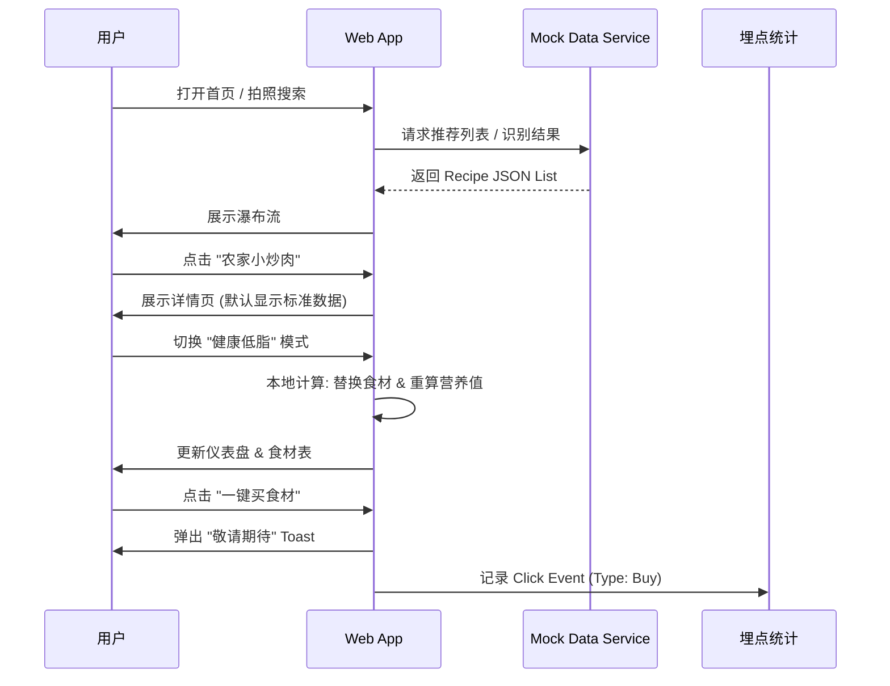

# 产品需求文档 (PRD) - 湘菜健康卫士 (SpicyHealth)

## 1. 核心目标 (Mission)
让湘菜爱好者在享受美味的同时，轻松掌握烹饪方法并实现科学的营养健康管理。同时，通过 MVP 验证用户对“食材购买”与“内容教学”的潜在商业兴趣。

## 2. 用户画像 (Persona)
*   **主要用户**：25-45岁，喜爱湘菜口味，但开始关注自身健康指标（如尿酸、体脂、血压）的中青年群体。
*   **核心痛点**：
    *   想吃湘菜但怕油腻/嘌呤高。
    *   在餐厅吃到好吃的菜，想回家复刻健康版。
    *   不知道如何调整传统菜谱以符合健康需求。

## 3. 产品路线图 (Roadmap)

### V1: 最小可行产品 (MVP)
聚焦“识别-教学-调整”闭环，并植入商业验证埋点。

1.  **📸 首页：视觉瀑布流与搜索入口**
    *   顶部显著的“拍照/上传”入口，用于快速识别菜品。
    *   下方采用 Pinterest 风格瀑布流，展示精选健康湘菜（如“低脂版农家小炒肉”），通过诱人图片吸引点击。
2.  **📖 详情页：标准 vs 健康对比**
    *   **双模式切换**：展示“传统正宗做法”与“健康改良做法”的对比。
    *   **营养仪表盘**：可视化展示嘌呤、脂肪、碳水、蛋白质含量（红/绿颜色区分风险等级）。
3.  **🎛 动态健康计算器**
    *   提供“少油”、“低盐”、“低嘌呤”开关或滑块。
    *   交互反馈：调整后，实时更新食材用量和营养数据。
4.  **📊 商业价值验证 (Fake Door Testing)**
    *   **埋点 A (食材电商)**：在配料表下方设置“一键购买同款低脂食材包”按钮。
    *   **埋点 B (内容直播)**：在步骤区设置“预约大厨直播教你做”按钮。
    *   *注：MVP 阶段点击仅弹出提示并记录点击数，不实际跳转。*

### V2 及以后版本 (Future Releases)
1.  **UGC 社区**：用户上传自己的改良食谱。
2.  **个人健康档案**：记录饮食日记，生成周报。
3.  **AI 深度定制**：结合体检数据推荐食谱。
4.  **真实的电商与直播接入**：基于 MVP 数据决定接入哪类服务。

## 4. 关键业务逻辑 (Business Rules)
1.  **数据优先级**：每道菜必须包含“标准”与“改良”两套数据模型。
2.  **改良算法 (MVP)**：基于规则的简单替换（例：开启低脂 -> 五花肉量*0, 瘦肉量*1.2, 油量*0.5）。
3.  **商业埋点逻辑**：记录 `click_event` { button_type: 'ingredient' | 'live', recipe_id: 'xxx', timestamp: '...' }。

## 5. 数据契约 (Data Contract)
核心对象 `Recipe` 结构示例：
```json
{
  "id": "recipe_001",
  "title": "农家小炒肉",
  "image": "url/to/image.jpg",
  "tags": ["高蛋白", "低嘌呤(改良后)"],
  "nutrition": {
    "standard": { "fat": 30, "protein": 20, "purine": "medium" },
    "healthy": { "fat": 12, "protein": 22, "purine": "low" }
  },
  "ingredients": [
    { "name": "五花肉", "amount": 200, "unit": "g", "type": "standard_only" },
    { "name": "瘦肉", "amount": 200, "unit": "g", "type": "healthy_only" },
    { "name": "青椒", "amount": 150, "unit": "g", "type": "common" }
  ]
}
```

## 6. MVP 原型设计 (ASCII - 方案 B)

**首页 (Home)**
```text
+-----------------------------------+
|  SpicyHealth           [📷 拍菜]  |
+-----------------------------------+
|  [🔍 搜索你想吃的湘菜...]          |
+-----------------------------------+
|  🔥 热门健康改良                   |
+-----------------------------------+
| +--------------+  +-------------+ |
| |  [图片]      |  |  [图片]     | |
| | 剁椒鱼头     |  | 永州血鸭    | |
| | 🟢 低嘌呤版  |  | 🔴 需控油   | |
| +--------------+  +-------------+ |
|                                   |
| +--------------+  +-------------+ |
| |  [图片]      |  |  [图片]     | |
| | 小炒黄牛肉   |  | 手撕包菜    | |
| | 🟢 高蛋白    |  | 🟢 高纤维   | |
| +--------------+  +-------------+ |
+-----------------------------------+
| [🏠 首页]  [❤️ 收藏]  [👤 我的]   |
+-----------------------------------+
```

**详情页 (Detail)**
```text
+-----------------------------------+
| < 返回       农家小炒肉           |
+-----------------------------------+
|          [ 诱人菜品大图 ]          |
+-----------------------------------+
| 营养分析:                         |
| 脂肪: [||||||||--] 🔴 高          |
| 嘌呤: [|||-------] 🟢 低          |
+-----------------------------------+
| 🛠 调整口味:                      |
| [ ] 传统原味   [x] 健康低脂       |
| (已为您替换五花肉为里脊，油量减半)  |
+-----------------------------------+
| 🛒 食材清单:                      |
| - 里脊肉 200g                     |
| - 青椒 150g                       |
| [ 🛍️ 一键买同款低脂食材包 ] (埋点)|
+-----------------------------------+
| 👨‍🍳 制作步骤:                      |
| 1. 瘦肉切片，用生抽腌制...         |
| [ 📺 预约大厨直播教你做 ] (埋点)   |
+-----------------------------------+
```

## 7. 架构设计蓝图 (Technical Blueprint)

### 7.1 核心流程图 (Mermaid)



### 7.2 技术选型
*   **前端框架**: HTML5 + TailwindCSS (CDN) + Vanilla JavaScript。
    *   *理由*: 极速构建，无构建步骤，便于快速迭代和修改。
*   **图标库**: FontAwesome (CDN)。
*   **数据存储**: 纯前端 Mock (JSON 对象)，暂无后端数据库。
*   **部署**: 静态页面部署 (如 Vercel 或 GitHub Pages)。

### 7.3 风险预判
*   **识别准确率**: MVP 使用 Mock 数据模拟“识别成功”，实际开发暂不接入真实 AI 识别，以免技术复杂度拖累验证进度。
*   **营养数据争议**: 需在页面显著位置标注“数据仅供参考，具体依实际烹饪为准”。
